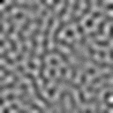
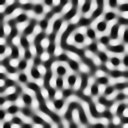
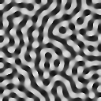

# KuramotoModel
[Generative models of cortical oscillations: neurobiological implications of the Kuramoto model](http://journal.frontiersin.org/article/10.3389/fnhum.2010.00190/full)
の3章あたりの実装.行列計算をOpenMPのMatを使い,OpenMPで並列計算を行う.  
128×128の以下のような画像を出力する  
  
  
  
